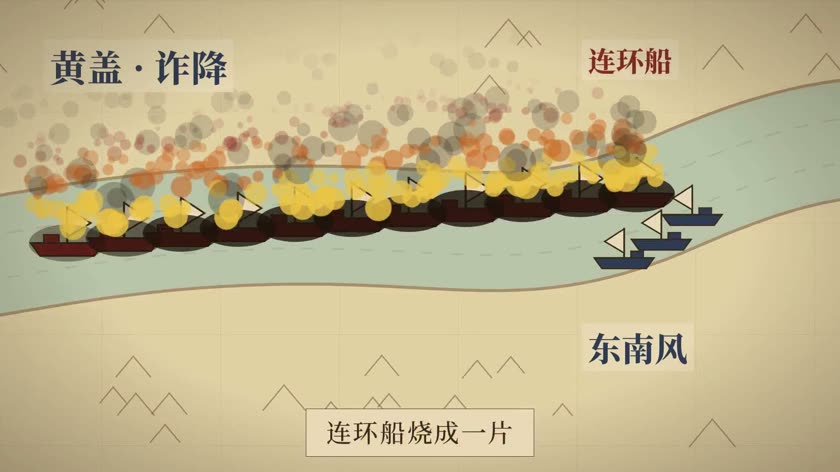
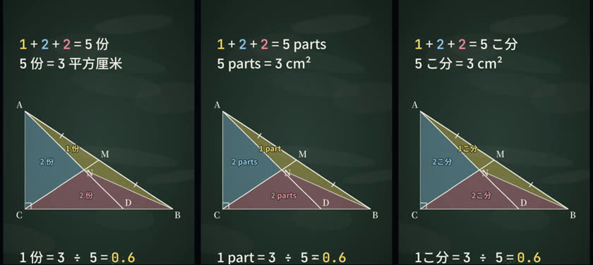
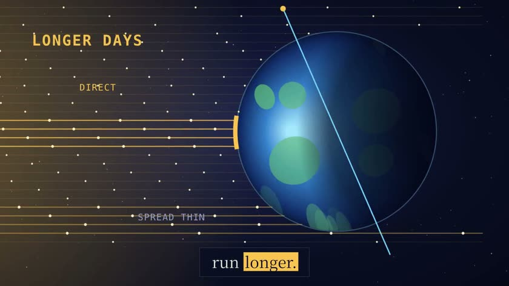
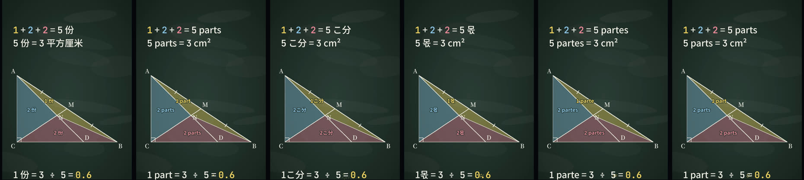
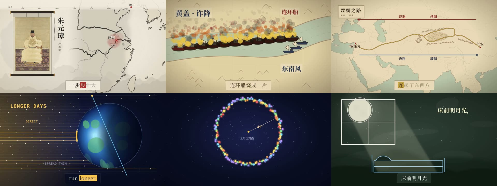
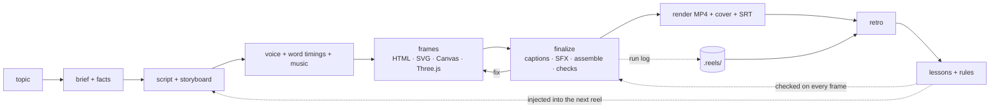

<div align="center">

# Reels-RSI

**The open-source AI reel director that evolves with every reel.**

One sentence in → a narrated, captioned, scored explainer reel out — rendered from code, directed by
*any* model, and a little smarter after every reel it makes.

[中文说明](README.zh-CN.md) · [📄 Paper](paper/README.md) · [How the self-improvement works](docs/rsi.md) · [ExplainReel-Bench](https://github.com/agentic-loops-x/ExplainReel-Bench) (separate benchmark) · [Models](docs/models.md) · [vs. other tools](docs/comparison.md)


https://github.com/user-attachments/assets/8c486fa7-1f6f-40bf-a8aa-ecaf04a252b6


<sub>The launch reel (57 s, <a href="https://github.com/user-attachments/assets/8c486fa7-1f6f-40bf-a8aa-ecaf04a252b6">watch with sound</a>) was made with Reels-RSI, and every picture in it is real output: reels the tool made, one lesson dubbed into six languages with <code>reels dub</code>, the first self-evolution round.</sub>

</div>

## Why Reels-RSI

|  | |
|---|---|
| 🔁 **Self-improving (RSI)** | Every reel leaves a trail — what the checks caught, which code fixed it, what you said. Reels-RSI turns that into **rules** (mistakes it can never make again, each proven on a failing and a passing example), **lessons** injected into the next reel, and a **benchmark** that lets the skill rewrite itself and keep only changes that score better. |
| 🔌 **Any model** | Directing runs in the agent you already use — Claude Code, Codex CLI, Gemini CLI, OpenCode (→ DeepSeek, Qwen, Kimi, GLM, local models). The judge and retro roles take any `provider:model`: Anthropic, OpenAI, Gemini, Qwen, DeepSeek, Kimi, GLM, Doubao, OpenRouter, Ollama, or your logged-in Claude Code — stdlib HTTP, no SDKs. |
| ⚡ **Simple** | `reels setup && reels install`, then ask your agent "/reels 做一个讲浮力的视频" — or run `reels make "…"` headless. Free by default: Edge TTS voices, procedural music and SFX, open fonts, public-domain maps. |

And it is **Chinese-first**: per-word TTS timing for karaoke captions, CJK line breaking, bilingual
中英 subtitles, font subsetting so the headless renderer never shows tofu, a history mode with maps
and period images, and a solve mode for school problems (math, physics, chemistry, 语文, stroke order).
Reels speak **中文 · English · 日本語 · 한국어 · Español · Français** — write the script in a language and the voice, captions,
fonts and subtitles follow (`reels voice --lang ja`; Noto JP / KR download on first use).

## Quick start

Requirements: Python ≥ 3.11 ([uv](https://docs.astral.sh/uv/)), Node ≥ 22, FFmpeg, and an agent CLI (Claude Code recommended).

```bash
uv tool install git+https://github.com/agentic-loops-x/Reels-RSI   # or: git clone … && uv tool install -e .
reels setup        # fonts (OFL), SFX library, HyperFrames CLI — one time
reels install      # adds the skill to Claude Code / Codex / ~/.agents/skills
reels doctor       # what's ready, which models play which role
```

Then, in your agent:

```
/reels 做一个 90 秒的视频：元朝是怎么灭亡的
/reels 小学奥数：鸡兔同笼，头 35 脚 94，用画图法讲解，9:16
/reels Make a 60-second explainer: why is the sky blue?
```

Or with no agent session open (headless, any harness/model):

```bash
reels make "为什么铁船不会沉？初中物理讲解" --length 60 --harness claude --model sonnet
reels make "Why do we have seasons?" --harness opencode --model deepseek/deepseek-chat   # untested harness
```

## What you can make

| | |
|---|---|
|  | **History** — 朝代速览 · 战役 · 人物 · 路线. Ink, atlas and notebook styles; d3-geo maps with historical-accuracy rules (winding order, period rivers and coasts), a reel-wide timeline overlay, Wikimedia Commons images with automatic credits. |
|  | **Solve** — 题目讲解 from 小学 to 高中: blackboard preset, KaTeX formulas (mhchem for chemistry), stroke-order animation (`reels hanzi`), answers verified in code before a word is scripted, and the check shown on screen. |
|  | **Science** — 科普讲解: Three.js / Canvas / SVG, deep-space and notebook styles, procedural particles, a scored review loop against a six-point rubric. |

**One reel, six languages.** `reels dub <reel> --lang ja` translates the narration and every word on
screen, then voices each line fitted to the original timing, so the same frames stay in step. A real
textbook geometry problem photographed in Chinese, dubbed into 中文 · English · 日本語 · 한국어 · Español · Français:





Also: wordless story shorts, long reels in chapters (`reels concat`), "make it look like this reference" (`reels analyze`), covers and SRT export.

## How it works



The deterministic half (TTS, captions, fonts, music, SFX, maps, assembly, checks, render) is a
plain CLI — the same bytes no matter which model calls it. The creative half (script, storyboard,
frame code, review) is the agent's, guided by the skill in [`src/reels_rsi/skill`](src/reels_rsi/skill).
Rendering is [HyperFrames](https://github.com/heygen-com/hyperframes) (Apache-2.0): headless Chrome
seeks a paused GSAP timeline frame by frame and FFmpeg encodes.

## The self-improvement loop (RSI, bounded and human-gated)

| Layer | Command | What it does |
|---|---|---|
| L0 · in-reel review | `reels finalize` · `reels score` | every pass is checked (HyperFrames lint/runtime/layout/contrast + Reels-RSI rules), logged, and scored on R1–R6 by a vision judge |
| L1 · cross-reel memory | `reels retro` · `reels lessons` | pairs each fixed issue with the diff that fixed it, adds your feedback, proposes lessons; you accept; accepted lessons are injected into every frame worker's packet |
| L2 · lessons → rules | `reels rules new/test` | a recurring mistake becomes a static check that ships with a failing and a passing example — no model can forget it |
| L3 · evolve the skill | `reels bench` · `reels evolve` | 8 fixed topics (train/holdout); an agent edits a copy of the skill, the copy makes the same reels, and the judge compares old vs new reels blind, per topic; the copy is kept only if it wins most votes on train **and** holds up on holdout — then you `evolve apply` |

Example: the Yuan reel's map once collapsed to a speck because a hand-drawn border ran
counter-clockwise. That cost a review round. It is now rule `polygon-winding` — run against the old
code, it flags the exact line. Details and design notes: [docs/rsi.md](docs/rsi.md).

## Code structure

### The three parts

```
 ┌───────────────────────────┐  reads  ┌───────────────────────────┐
 │ ① skill/  (Markdown)      │ ──────▶ │ your agent (Claude Code…) │  the creative half —
 │   the director's handbook │         │ script, storyboard, frame │  model-driven, varies per run
 └───────────────────────────┘         │ code, review              │
                                       └─────────────┬─────────────┘
                                                     │ runs `reels …`
                                                     ▼
 ┌───────────────────────────┐  r/w    ┌───────────────────────────┐
 │ ③ ~/.reels/  (memory)   │ ◀─────▶ │ ② reels CLI  (Python)   │  the deterministic half —
 │   lessons, rules, bench   │         │ voice, captions, assemble,│  same input → same bytes
 └───────────────────────────┘         │ checks, render            │
                                       └───────────────────────────┘
```

① is why **any model** works — it is plain instructions any file-reading, command-running agent can
follow. ② is why it is **simple** — every non-creative chore is one command. ③ is the **RSI** — what
past reels taught, fed back into the next one.

### Layout

```
src/reels_rsi/
├── cli.py            entry point — the command table, dispatches `reels <cmd>` to a module
├── paths.py          single source of truth for locations (package, ~/.reels, skill dir)
├── env.py            setup · doctor · install · make (headless reel)
├── config.py         which model plays which role (harness / judge / retro)
├── agents.py         model plug-in #1: hand a whole reel to an agent CLI (claude/codex/gemini/opencode)
├── llm.py            model plug-in #2: one-shot calls for judge + retro, 12 providers, stdlib HTTP
├── langs.py          the languages: voice, caption mode, Noto family, speaking rate (zh en ja ko es fr)
├── project.py        reel lifecycle: new → packets → finalize → render (the deterministic conductor)
├── pipeline/         one file per production step
│   ├── tts.py            narration + per-word timings + real durations → storyboard + music bed
│   ├── captions_cjk.py   karaoke captions (CJK line breaking, bilingual)
│   ├── fonts.py          subset fonts to the characters the reel uses
│   ├── music.py sfx.py   procedural score / sound effects (offline, deterministic)
│   ├── srt.py cover.py   subtitle export · cover image
│   ├── dub.py            one reel into another language: translate, replace on-screen text, fitted voice
│   ├── geo.py commons.py hanzi.py overlays.py   maps · Commons images · stroke order · reel-wide overlays
│   └── frame_times.py gen_image.py              review timestamps · optional generated illustrations
├── rsi/              self-improvement
│   ├── runlog.py         L0  per-pass log + code snapshot of every finalize
│   ├── score.py          L0  deterministic score + vision judge (R1–R6)
│   ├── retro.py          L1  evidence (issue → the diff that fixed it) → proposed lessons
│   ├── lessons.py        L1  inbox → human accept → digest injected into frame packets
│   ├── lint.py rules/    L2  rule engine; each rule = rule.py + bad.* (must fire) + good.* (must pass)
│   ├── bench.py          L3  fixed topics, headless reels, scored
│   └── evolve.py         L3  edit a copy of the skill, keep it only if the benchmark improves
├── skill/            ① SKILL.md (steps 0–9) + references/ (quality bar, frame worker, solve, history, styles…)
├── presets/<style>/  deepspace · notebook · ink · atlas · chalk — FRAME.md, caption skin, optional kit/*.js
├── prompts/          templates sent to models: make · retro · propose
├── bench/topics.toml 8 benchmark topics (4 train, 4 holdout)
└── vendor/hyperframes/  adapted HyperFrames Node scripts: assemble, transitions, captions
tests/                pytest; every rule's examples run here too
docs/                 rsi.md · models.md · comparison.md · release-checklist.md
```

### A reel through the code

| Step | Who | Command | Code | Writes (in the reel folder) |
|---|---|---|---|---|
| brief, research | agent | — | `skill/SKILL.md` | `BRIEF.md` |
| scaffold | CLI | `reels new` | `project.py` | project, preset, kit |
| script, storyboard | agent | — | `references/script-and-storyboard.md` | `SCRIPT.md`, `STORYBOARD.md` |
| voice | CLI | `reels voice` | `pipeline/tts.py`, `music.py` | `assets/voice/`, `audio_meta.json`, music |
| packets | CLI | `reels packets` | `project.py` + `rsi/lessons.py` | `.reels/packets/` — per-frame briefs **with accepted lessons** |
| frames | agent (parallel) | — | `references/frame-worker.md` | `compositions/frames/*.html` |
| finalize (repeat) | CLI | `reels finalize` | `project.py` → fonts, captions, sfx, assemble, transitions, checks, **rules**, snapshots | `index.html`, `snapshots/`, **`.reels/runs.jsonl` + `history/NNN`** |
| deliver | CLI | `reels render` · `cover` · `srt` | `project.py`, `pipeline/cover.py`, `srt.py` | `renders/` |
| learn | CLI + model + you | `reels score` · `retro` · `lessons` | `rsi/` | lessons → inbox → (you accept) → next reel |

### Where things live

| Location | Holds | Written by |
|---|---|---|
| package `src/reels_rsi/` | skill, presets, built-in rules, prompts, bench topics | developers (and `evolve apply`) |
| `~/.reels/` | fonts, SFX, lessons, your rules, feedback, bench runs, `config.toml` | the CLI and you |
| a reel folder | script, storyboard, frames, audio, renders, and `.reels/` (that reel's log, snapshots, packets, retro evidence) | the agent and the CLI |

Reading order for contributors: `cli.py` → `skill/SKILL.md` → `cmd_finalize` in `project.py` →
`rsi/lessons.py` and `rsi/rules/visible-from-state/` → `rsi/bench.py`, `rsi/evolve.py`.

## Paper

**Reels-RSI: Program-Level Self-Improvement for Code-Rendered Explainer Videos** (Agentic Loops X, preprint, October 2026) —
[PDF](paper/versions/v7/main.pdf) · [source, data and versions](paper/README.md) · arXiv: *submitted, ID pending*.

The paper makes the case that an explainer video is a *program* a renderer turns into frames, and
that this is what makes self-improvement auditable: lessons compile into unit-tested rules that can be
run over every reel made before them, and a benchmark-gated step rewrites the director's playbook only
when blind pairwise judgments on held-out topics prefer it. It reports 111 reels: a field study, two
playbook evolutions, a 2×2 memory ablation, a weaker director, a 48-reel learning curve and a judge-reliability
study — including the finding that the first evolve verdict was a position bias in our own vote design.

```bibtex
@misc{reelsrsi2026,
  title  = {Reels-RSI: Program-Level Self-Improvement for Code-Rendered Explainer Videos},
  author = {{Agentic Loops X}},
  year   = {2026},
  note   = {Preprint. Code and data: https://github.com/agentic-loops-x/Reels-RSI}
}
```

## Status — what is verified

| | |
|---|---|
| ✅ verified on real reels | full pipeline on 4 reels (two made from scratch with Reels-RSI during release testing, incl. a real textbook geometry problem from a photo), 9:16 and 16:9, Chinese TTS/captions/fonts, English and bilingual 中英 voice → captions → SRT, maps, overlays, Commons, KaTeX + stroke order, chalk kit, clean install from git, 81 unit tests |
| ✅ self-improvement, verified | run log + code snapshots on every pass · vision judge (`claude-cli:sonnet`, ~30 s per reel) · model retro proposing lessons from a real bug→fix history · lessons accepted and injected into packets — including a headless benchmark reel, filtered by `when` · a lesson compiled into a rule that found 3 latent bugs in older reels · `bench`: a headless Claude Code (sonnet) session made a 28.5 s science reel from one sentence (0 check errors, composite 76.8) and filed its own lessons |
| ✅ evolve, two real rounds | 32 headless reels, blind pairwise verdicts. Round 1 read 11–1 on train and 8–4 on holdout, but re-judging (170 calls, three judge models) showed most of that margin was the judge's preference for the second-shown reel; `compare` now shows each order equally often and the gate judges every topic from the slot shown first. Round 2 under the corrected gate was accepted (4–0 train, 2–2 holdout) and deliberately left unapplied — the human gate the design calls for. Round 1 also surfaced a code bug in the blackboard kit ([details](docs/rsi.md#the-first-real-round-2026-10-06), [paper §5](paper/README.md)) |
| 🧪 implemented, not yet run | `make` outside bench |
| ❔ untested | Codex / Gemini / OpenCode harnesses, non-Anthropic judges against real APIs (tested against a mock server), ElevenLabs voices, image-generation layers |

## Credits & licenses

Reels-RSI is Apache-2.0. It vendors workflow scripts and caption skins from HyperFrames (Apache-2.0,
see [NOTICE](NOTICE)); fonts are SIL OFL (downloaded at setup); maps are Natural Earth (public
domain); stroke data is hanzi-writer-data (Arphic Public License, credited per reel); Commons images
are credited per reel in `CREDITS.md`. Voices use Microsoft Edge's online TTS through
[edge-tts](https://github.com/rany2/edge-tts) — an unofficial endpoint; for commercial use prefer
ElevenLabs or another licensed TTS.
