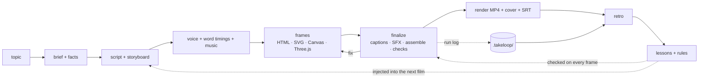

<div align="center">

# TakeLoop

**The open-source AI film director that gets better with every take.**

One sentence in → a narrated, captioned, scored explainer film out — rendered from code, directed by
*any* model, and a little smarter after every film it makes.

[中文说明](README.zh-CN.md) · [How the self-improvement works](docs/rsi.md) · [Models](docs/models.md) · [vs. other tools](docs/comparison.md)


<sub>「元朝是怎么灭亡的」— 96 s ink-wash history film: hand-sketched maps (Natural Earth + d3-geo), a film-wide year ruler, a public-domain portrait, karaoke captions, procedural score. Made with this pipeline.</sub>

</div>

## Why TakeLoop

|  | |
|---|---|
| 🔁 **Self-improving (RSI)** | Every film leaves a trail — what the checks caught, which code fixed it, what you said. TakeLoop turns that into **rules** (mistakes it can never make again, each proven on a failing and a passing example), **lessons** injected into the next film, and a **benchmark** that lets the skill rewrite itself and keep only changes that score better. |
| 🔌 **Any model** | Directing runs in the agent you already use — Claude Code, Codex CLI, Gemini CLI, OpenCode (→ DeepSeek, Qwen, Kimi, GLM, local models). The judge and retro roles take any `provider:model`: Anthropic, OpenAI, Gemini, Qwen, DeepSeek, Kimi, GLM, Doubao, OpenRouter, Ollama, or your logged-in Claude Code — stdlib HTTP, no SDKs. |
| ⚡ **Simple** | `takeloop setup && takeloop install`, then ask your agent "/takeloop 做一个讲浮力的视频" — or run `takeloop make "…"` headless. Free by default: Edge TTS voices, procedural music and SFX, open fonts, public-domain maps. |

And it is **Chinese-first**: per-word TTS timing for karaoke captions, CJK line breaking, bilingual
中英 subtitles, font subsetting so the headless renderer never shows tofu, a history mode with maps
and period images, and a solve mode for school problems (math, physics, chemistry, 语文, stroke order).

## Quick start

Requirements: Python ≥ 3.11 ([uv](https://docs.astral.sh/uv/)), Node ≥ 22, FFmpeg, and an agent CLI (Claude Code recommended).

```bash
uv tool install git+https://github.com/OWNER/takeloop   # or: git clone … && uv tool install -e .
takeloop setup        # fonts (OFL), SFX library, HyperFrames CLI — one time
takeloop install      # adds the skill to Claude Code / Codex / ~/.agents/skills
takeloop doctor       # what's ready, which models play which role
```

Then, in your agent:

```
/takeloop 做一个 90 秒的视频：元朝是怎么灭亡的
/takeloop 小学奥数：鸡兔同笼，头 35 脚 94，用画图法讲解，9:16
/takeloop Make a 60-second explainer: why is the sky blue?
```

Or with no agent session open (headless, any harness/model):

```bash
takeloop make "为什么铁船不会沉？初中物理讲解" --length 60 --harness claude --model sonnet
takeloop make "Why do we have seasons?" --harness opencode --model deepseek/deepseek-chat   # untested harness
```

## What you can make

| | |
|---|---|
|  | **History** — 朝代速览 · 战役 · 人物 · 路线. Ink, atlas and notebook styles; d3-geo maps with historical-accuracy rules (winding order, period rivers and coasts), a film-wide timeline overlay, Wikimedia Commons images with automatic credits. |
|  | **Solve** — 题目讲解 from 小学 to 高中: blackboard preset, KaTeX formulas (mhchem for chemistry), stroke-order animation (`takeloop hanzi`), answers verified in code before a word is scripted, and the check shown on screen. |
|  | **Science** — 科普讲解: Three.js / Canvas / SVG, deep-space and notebook styles, procedural particles, a scored review loop against a six-point rubric. |

Also: wordless story shorts, long films in chapters (`takeloop concat`), "make it look like this reference" (`takeloop analyze`), covers and SRT export.

## How it works



The deterministic half (TTS, captions, fonts, music, SFX, maps, assembly, checks, render) is a
plain CLI — the same bytes no matter which model calls it. The creative half (script, storyboard,
frame code, review) is the agent's, guided by the skill in [`src/takeloop/skill`](src/takeloop/skill).
Rendering is [HyperFrames](https://github.com/heygen-com/hyperframes) (Apache-2.0): headless Chrome
seeks a paused GSAP timeline frame by frame and FFmpeg encodes.

## The self-improvement loop (RSI, bounded and human-gated)

| Layer | Command | What it does |
|---|---|---|
| L0 · in-film review | `takeloop finalize` · `takeloop score` | every pass is checked (HyperFrames lint/runtime/layout/contrast + TakeLoop rules), logged, and scored on R1–R6 by a vision judge |
| L1 · cross-film memory | `takeloop retro` · `takeloop lessons` | pairs each fixed issue with the diff that fixed it, adds your feedback, proposes lessons; you accept; accepted lessons are injected into every frame worker's packet |
| L2 · lessons → rules | `takeloop rules new/test` | a recurring mistake becomes a static check that ships with a failing and a passing example — no model can forget it |
| L3 · evolve the skill | `takeloop bench` · `takeloop evolve` | 8 fixed topics (train/holdout); an agent edits a copy of the skill, the copy makes the same films, and it is kept only if it beats the baseline on train **and** holds up on holdout — then you `evolve apply` |

Example: the Yuan film's map once collapsed to a speck because a hand-drawn border ran
counter-clockwise. That cost a review round. It is now rule `polygon-winding` — run against the old
code, it flags the exact line. Details and design notes: [docs/rsi.md](docs/rsi.md).

## Status — what is verified

| | |
|---|---|
| ✅ verified on real films | full pipeline (two films delivered), Chinese TTS/captions/fonts, maps, overlays, Commons, retro on a real bug→fix history, 12 rules on their examples + real films, KaTeX + stroke order in a render, 63 unit tests |
| 🧪 implemented, needs a model/budget to exercise | vision judge (`claude-cli` needs a logged-in `claude`; API providers tested against a mock server), `bench`, `evolve`, headless `make` |
| ❔ untested | Codex / Gemini / OpenCode harnesses, ElevenLabs voices, image-generation layers |

## Credits & licenses

TakeLoop is Apache-2.0. It vendors workflow scripts and caption skins from HyperFrames (Apache-2.0,
see [NOTICE](NOTICE)); fonts are SIL OFL (downloaded at setup); maps are Natural Earth (public
domain); stroke data is hanzi-writer-data (Arphic Public License, credited per film); Commons images
are credited per film in `CREDITS.md`. Voices use Microsoft Edge's online TTS through
[edge-tts](https://github.com/rany2/edge-tts) — an unofficial endpoint; for commercial use prefer
ElevenLabs or another licensed TTS.
