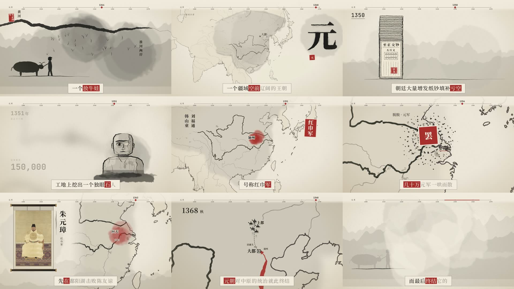

<div align="center">

# Reels-RSI · 会进化的开源 AI 导演

一句话进去，一部带配音、字幕、配乐的讲解视频出来。画面全部由代码渲染，任何模型都能当导演，
而且**每拍一部，它就变强一点**。

[English](README.md) · [自我改进原理](docs/rsi.md) · [模型选择](docs/models.md) · [与其他工具对比](docs/comparison.md)



<sub>《元朝是怎么灭亡的》：96 秒水墨历史片，包含手绘疆域地图、贯穿全片的年代标尺、公版肖像、逐字高亮字幕和程序化配乐。</sub>

</div>

## 三个卖点

- **🔁 会自我改进（RSI）**：每部片子都会留下记录：检查抓到了什么问题、哪段代码修好了它、你说了什么。Reels-RSI 把这些记录变成三样东西：
  - **规则**：犯过的错写成自动检查，每条规则都附带一个必须报错的样例和一个必须通过的样例。
  - **经验**：自动写进下一部片子的制作说明。
  - **基准测试**：技能可以自己改写自己，但只有在跑分里确实更好的改动才会保留。
- **🔌 模型随便换**：导演工作交给你已经在用的智能体：Claude Code、Codex CLI、Gemini CLI，或者 OpenCode（可以接 DeepSeek、通义千问、Kimi、智谱 GLM、本地模型）。评审和复盘这两个角色可以填任意 `厂商:模型`。不依赖任何 SDK。
- **⚡ 足够简单**：`reels setup && reels install` 装好以后，对智能体说一句「/reels 做一个讲浮力的视频」就行；也可以用 `reels make "…"` 一条命令出片。默认全免费：Edge 中文配音、程序化配乐和音效、开源字体、公有领域地图。

**中文优先**：
- 配音给出逐字时间，字幕逐字高亮。
- 中文断句、中英双语字幕。
- 字体按片子里实际用到的字裁剪打包，渲染时不会出现方块字。
- 历史模式：地图，加上历史地理校验，比如多边形绕向、古代河道。
- **解题模式**：小学到高中的数学、物理、化学、语文讲解，用板书风格，带公式和笔顺动画；答案先用代码算过，片子里会演示验算。

## 快速开始

需要：Python ≥ 3.11（[uv](https://docs.astral.sh/uv/)）、Node ≥ 22、FFmpeg，以及一个智能体 CLI（推荐 Claude Code）。

```bash
uv tool install git+https://github.com/agentic-loops-x/Reels-RSI
reels setup      # 一次性：字体、音效库、HyperFrames
reels install    # 把技能装进 Claude Code / Codex / ~/.agents/skills
reels doctor     # 检查环境，看每个角色用的是哪个模型
```

然后在智能体里说：

```
/reels 做一个 90 秒的视频：元朝是怎么灭亡的
/reels 小学奥数：鸡兔同笼，头 35 脚 94，用画图法讲解，竖屏
/reels 古诗《静夜思》逐句讲解，水墨风
```

## 能做什么

| 类型 | 说明 |
|---|---|
| 历史 | 朝代速览、战役、人物、路线；水墨、古地图、手账三种风格；地图有古今地理校验；维基共享资源图片自动署名 |
| 解题 | 板书风格；KaTeX 公式（化学方程式用 mhchem）；笔顺动画（`reels hanzi`）；先验算再写稿，片中演示验算 |
| 科普 | Three.js / Canvas / SVG；深空和手账风格；按 6 项评分表审片 |
| 其他 | 无台词故事短片、分章节长片、「照这个视频的风格做」、封面、SRT 字幕 |

## 自我改进的四层

| 层级 | 命令 | 作用 |
|---|---|---|
| L0 片内审查 | `finalize` · `score` | 每轮都跑 HyperFrames 检查和 Reels-RSI 规则，结果记日志；视觉模型按 R1–R6 打分 |
| L1 跨片记忆 | `retro` · `lessons` | 把每个修掉的问题和修它的代码改动对应起来，加上你的反馈，提出经验；你同意的经验会注入以后每个镜头的制作包 |
| L2 经验变规则 | `rules new/test` | 反复出现的错误编译成静态检查，附带正反样例，换哪个模型都绕不过 |
| L3 技能进化 | `bench` · `evolve` | 8 个固定题目分训练集和验证集。智能体改一份技能副本，用它重拍同样的题目；评审把新旧两版同一题目的片子放在一起盲比（交换顺序投 3 票）；训练集上新版赢得多数票、验证集上不输，才算通过，最后由你 `evolve apply` 确认 |

## 代码结构

### 先看全局：三块东西

Reels-RSI 只由三部分组成，分清它们，整个项目就清楚了：

```
 ┌──────────────────────────┐   读    ┌──────────────────────────┐
 │ ① 技能 skill/（Markdown） │ ──────▶ │ 智能体（Claude Code 等）   │  创作的那一半：
 │   告诉导演"怎么拍"         │         │ 写脚本、分镜、每个镜头的代码 │  每次结果都不同，靠模型
 └──────────────────────────┘         └────────────┬─────────────┘
                                                    │ 调用 reels 命令
                                                    ▼
 ┌──────────────────────────┐  读写   ┌──────────────────────────┐
 │ ③ 记忆 ~/.reels/        │ ◀─────▶ │ ② 命令行 reels（Python）│  确定性的那一半：
 │   经验、规则、跑分记录      │         │ 配音、字幕、拼装、检查、渲染 │  同样输入 → 同样输出
 └──────────────────────────┘         └──────────────────────────┘
```

- **① 技能**是一组 Markdown 文档，相当于"导演手册"，说明每一步做什么、画面质量的标准、常见坑。
  它不是代码，任何能读文件、跑命令的智能体都能照着做，所以**模型可以随便换**。
- **② 命令行**把所有不需要创意的活儿都包了：配音、逐字时间、字幕、字体、配乐、音效、地图、
  拼装、检查、渲染。智能体只需要敲 `reels voice`、`reels finalize` 这样的命令，所以**用起来简单**。
- **③ 记忆**放在用户目录 `~/.reels/`，存的是从每部片子里学到的东西。下一部片子开工时，
  命令行会把它们注入给智能体，这就是 **RSI（自我改进）**。

### 目录树

```
reels.nosync/
├── pyproject.toml            包的定义；安装后得到 `reels` 命令
├── install.sh                一键安装脚本（uv tool install + setup + install）
├── src/reels_rsi/
│   ├── cli.py                入口：把 `reels <命令>` 分发到下面各模块（命令表在这里）
│   ├── paths.py              所有路径的唯一来源：包内资源、~/.reels、技能目录
│   ├── env.py                setup（下载字体/音效）· doctor（体检）· install（装技能）· make（无人值守出片）
│   ├── config.py             哪个模型扮演哪个角色（导演 / 评审 / 复盘），读 config.toml 和环境变量
│   ├── agents.py             模型接入方式一：把整部片子交给一个智能体 CLI（claude / codex / gemini / opencode）
│   ├── llm.py                模型接入方式二：一次性问答调用（评审打分、复盘提经验），支持 12 家厂商
│   ├── project.py            片子的生命周期：new → packets → finalize → render（确定性步骤的总调度）
│   │
│   ├── pipeline/             流水线上的每道工序，一个文件一件事
│   │   ├── tts.py              配音 + 逐字时间 + 把真实时长写回分镜 + 生成配乐
│   │   ├── captions_cjk.py     逐字高亮字幕（中文断句、中英双语）
│   │   ├── fonts.py            按片中实际用字裁剪字体，渲染时不出方块字
│   │   ├── music.py · sfx.py   程序化配乐 / 音效（离线、免费、可复现）
│   │   ├── srt.py              导出 SRT 字幕（中 / 英 / 中英）
│   │   ├── cover.py            封面（可取某一镜头、不带字幕）
│   │   ├── geo.py · commons.py 历史片：Natural Earth 地图数据 / 维基共享资源图片（自动署名）
│   │   ├── hanzi.py            汉字笔顺数据
│   │   ├── overlays.py         贯穿全片的叠加层（年代标尺、章节条）
│   │   ├── frame_times.py      每个镜头的时间窗、审片取样时间点
│   │   └── gen_image.py        可选：AI 生图图层（需要图像 API key）
│   │
│   ├── rsi/                  自我改进（详见下一节）
│   │   ├── runlog.py           L0 每轮 finalize 的日志 + 代码快照
│   │   ├── score.py            L0 打分：确定性扣分 + 视觉评审 R1–R6
│   │   ├── retro.py            L1 复盘：整理证据，让模型提经验
│   │   ├── lessons.py          L1 经验库：收件箱 → 你批准 → 注入下一部片子
│   │   ├── lint.py             L2 规则引擎：加载、运行、测试规则
│   │   ├── rules/<规则名>/     L2 每条规则 = rule.py + bad.*（必须报错）+ good.*（必须通过）
│   │   ├── bench.py            L3 基准测试：固定题目，无人值守拍片并打分
│   │   └── evolve.py           L3 技能进化：改一份技能副本，跑分更好才保留
│   │
│   ├── skill/                ① 导演手册（智能体读的就是这里）
│   │   ├── SKILL.md            主流程：第 0 步需求 → 第 9 步复盘
│   │   └── references/         分主题的细则：质量标准、镜头制作规范、解题、历史、风格、技巧
│   ├── presets/<风格>/       五种画面风格：deepspace · notebook · ink · atlas · chalk
│   │   ├── FRAME.md            这种风格的配色、字体、动效规范
│   │   ├── caption-skin.html   字幕外观
│   │   └── kit/*.js            可选：共用绘图工具包（chalk 有板书工具包）
│   ├── prompts/              交给模型的提示词模板：make（出片）· retro（复盘）· propose（进化提案）
│   ├── bench/topics.toml     基准测试的 8 个固定题目（训练集 4 + 验证集 4）
│   └── vendor/hyperframes/   从 HyperFrames 引入并修改的 Node 脚本：拼装、转场、字幕
├── tests/                    单元测试（pytest），规则的正反样例也在这里自动跑
└── docs/                     原理（rsi.md）、模型（models.md）、对比、发布检查清单
```

### 一部片子在代码里怎么走

| 步骤 | 谁来做 | 命令 | 代码 | 产出（在片子目录里） |
|---|---|---|---|---|
| 1 需求、查资料 | 智能体 | — | `skill/SKILL.md` | `BRIEF.md` |
| 2 建项目 | 命令行 | `reels new` | `project.py` | 项目骨架、风格文件、工具包 |
| 3 脚本、分镜 | 智能体 | — | `skill/references/script-and-storyboard.md` | `SCRIPT.md` `STORYBOARD.md` |
| 4 配音 | 命令行 | `reels voice` | `pipeline/tts.py` `music.py` | `assets/voice/` `audio_meta.json`、配乐 |
| 5 制作包 | 命令行 | `reels packets` | `project.py` + `rsi/lessons.py` | `.reels/packets/`：每个镜头的任务书，**已批准的经验就写在这里** |
| 6 做镜头 | 智能体（可并行） | — | `skill/references/frame-worker.md` | `compositions/frames/*.html` |
| 7 合成检查 | 命令行 | `reels finalize` | `project.py` → 字体、字幕、音效、拼装、转场、检查、**规则**、快照 | `index.html`、`snapshots/`、**`.reels/runs.jsonl` 和代码快照** |
| 8 渲染交付 | 命令行 | `reels render` `cover` `srt` | `project.py` `pipeline/cover.py` `srt.py` | `renders/video.mp4` `cover.jpg` `*.srt` |
| 9 复盘 | 命令行 + 模型 + 你 | `reels score` `retro` `lessons` | `rsi/` | 经验进收件箱，你批准后进入下一部片子 |

第 6 步做完会回到第 7 步，可以反复多轮：检查报错 → 改镜头 → 再检查。**每一轮都会被记下来**，这正是复盘的原材料。

### RSI 在代码里的位置

| 层 | 学到的东西存在哪 | 怎么影响下一部片子 | 代码 |
|---|---|---|---|
| L0 片内记录 | `<片子>/.reels/runs.jsonl`、`history/001…`（每轮代码快照）、`score.json` | 给 L1 提供证据："第 3 轮报了对比度错误，第 4 轮改了这几行就好了" | `rsi/runlog.py` `score.py` |
| L1 经验 | `~/.reels/lessons/{inbox,accepted,rejected}/*.md` | `reels packets` 把已批准的经验写进每个镜头的任务书，智能体一开工就能看到；经验可以带适用条件（如 `preset=chalk`、`aspect=9:16`），只发给适用的片子 | `rsi/retro.py` `lessons.py` |
| L2 规则 | `rsi/rules/`（内置）、`~/.reels/rules/`（你自己的） | 每次 `finalize` 和 `lint` 自动检查，模型不可能"忘记" | `rsi/lint.py` |
| L3 技能进化 | `~/.reels/bench/runs/`（跑分）、技能副本 | 改写 `skill/` 本身；只有盲比中训练集赢、验证集不输，并且你执行 `evolve apply`，才会生效 | `rsi/bench.py` `evolve.py` |

经验是"建议"，规则是"强制"。一条经验如果能从代码文本里检查出来（比如"从可见状态开始的动画要加 `immediateRender: false`"），
就可以升级成规则 `visible-from-state`。这条规则一加上，就在以前的元朝片和天空片里找出了 3 处没人发现的同类 bug。

**每一步都有人把关**：模型提出的经验先进收件箱，你同意才生效；技能改写也必须由你 `evolve apply`。
这不是摆设：发布验证时，评审模型因为取样图太小误判"画面比例不对"，复盘模型据此提出一条错误经验。
如果自动生效，它就会误导以后所有的片子。

### 两种接入模型的方式

| | `agents.py`：把整部片子交给智能体 | `llm.py`：一问一答 |
|---|---|---|
| 用在 | 导演（`make`、`bench`、`evolve`） | 评审打分（`score`）、复盘提经验（`retro`） |
| 能接 | Claude Code、Codex CLI、Gemini CLI、OpenCode（再接 DeepSeek、千问、Kimi、GLM、本地模型） | `厂商:模型`，例如 `qwen:qwen-vl-max`、`deepseek:deepseek-chat`、`claude-cli:sonnet`、`ollama:qwen2.5vl` |
| 配置 | `reels config set agent.harness opencode`、`reels config set agent.model deepseek/deepseek-chat` | `reels config set roles.judge gemini:gemini-2.5-pro` |

`llm.py` 只用 Python 标准库发 HTTP 请求，不依赖任何 SDK。新增一家兼容 OpenAI 接口的厂商，只需要在 `config.toml` 里加三行。

### 三个存放数据的地方

| 位置 | 内容 | 谁写 |
|---|---|---|
| 安装包 `src/reels_rsi/` | 技能、风格、内置规则、提示词、基准题目 | 开发者（以及 `evolve apply`） |
| 用户目录 `~/.reels/` | 字体、音效库、经验库、你的规则、反馈记录、跑分记录、`config.toml` | 命令行和你 |
| 片子目录 `videos/<名字>/` | 脚本、分镜、镜头代码、音频、渲染结果，以及 `.reels/`（这部片子的日志、快照、制作包、复盘证据） | 智能体和命令行 |

### 想读代码，建议的顺序

1. `cli.py`：看有哪些命令，各自对应哪个模块。
2. `skill/SKILL.md`：看一部片子从头到尾的流程。
3. `project.py` 里的 `cmd_finalize`：流水线的核心，所有工序在这里串起来。
4. `rsi/lessons.py` 和 `rsi/rules/visible-from-state/`：一条经验和一条规则长什么样。
5. `rsi/bench.py` 和 `rsi/evolve.py`：技能怎么改写自己。

## 已验证 / 待验证

| 状态 | 内容 |
|---|---|
| ✅ 已在真实片子上验证 | 4 部片子跑通完整流水线（其中 2 部是发布验证期间用 Reels-RSI 从零制作的，包括一道拍照的真实几何题）、横竖屏、中文配音/字幕/字体、英文和中英双语的配音 → 字幕 → SRT、地图、全片时间轴、公版图片、公式和笔顺、黑板工具包、从 git 干净安装、81 个单元测试 |
| ✅ 自我改进，已验证 | 每轮的日志和代码快照；视觉评审（`claude-cli:sonnet`，一部片子约 30 秒）；模型根据真实的"出错 → 修复"记录自动提经验；经验批准后注入制作包（无人值守的基准测试片子也收到了，并按风格/画幅过滤）；一条经验编译成规则，在旧片子里找出 3 处潜在 bug；基准测试：无人值守的 Claude Code（sonnet）凭一句话做出 28.5 秒科普片，检查 0 错误，综合分 76.8，还自己登记了 3 条经验 |
| ✅ 技能进化，实跑一轮 | 无人值守拍了 16 部片子，盲比结果：进化后的技能在训练集 11:1、验证集 8:4 胜出（[详情](docs/rsi.md#the-first-real-round-2026-10-06)），还顺带找出了黑板工具包的一个代码 bug |
| 🧪 已实现，还没实跑 | 基准测试之外的 `make` |
| ❔ 未测试 | Codex / Gemini / OpenCode 作为导演、非 Anthropic 的评审模型接真实 API（已用模拟服务器测过）、ElevenLabs 配音、AI 生图图层 |

许可证 Apache-2.0。署名与第三方许可见 [NOTICE](NOTICE)。配音用的是微软 Edge 的在线 TTS，属于非官方接口；商用请改用 ElevenLabs 等有授权的 TTS。
